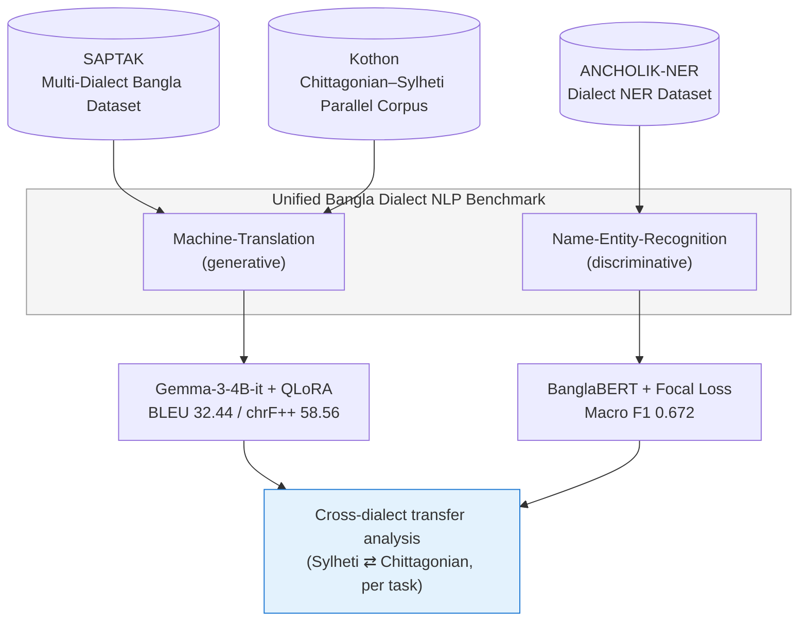

# Bangla Dialect NLP Benchmark

**A unified multi-task benchmark for generative and discriminative NLP on low-resource Bangla dialects.**

## Sub-Projects

| Repo | Task | Core Result |
|---|---|---|
| 🔤 [**Machine-Translation**](https://github.com/rahhhmann/Machine-Translation) | Dialect → Standard Bangla **generative** translation | Gemma-3-4B-it + QLoRA: **BLEU 32.44 / chrF++ 58.56** (combined) |
| 🏷️ [**Name-Entity-Recognition**](https://github.com/rahhhmann/Name-Entity-Recognition) | Dialect **discriminative** entity recognition | BanglaBERT + Focal Loss: **Macro F1 0.672** |

Each sub-project is fully self-contained — its own data pipeline, `requirements.txt`, `.gitignore`, notebooks, results, figures, and a detailed README with methodology, results tables, and mermaid diagrams. This README is the map that ties them together.

---

## Why Two Tasks, One Benchmark

Bengali dialects such as Sylheti and Chittagonian are underrepresented in NLP research despite Bengali's large global speaker population. Most existing datasets, pretrained models, and benchmarks target Standard Bangla only. This project addresses that gap from both major NLP paradigms at once:

- **Generative NLP** (Machine Translation) — can a modern instruction-tuned LLM, efficiently adapted with QLoRA, learn to normalize dialectal Bengali into Standard Bangla?
- **Discriminative NLP** (Named Entity Recognition) — can a pretrained encoder, combined with imbalance-aware optimization, reliably extract entities from dialectal Bengali text?

Studying both tasks side-by-side, on the same two dialects, also enables a shared **cross-dialect transfer analysis** — testing whether knowledge learned on Sylheti generalizes to Chittagonian, and vice versa, for each paradigm.



---

## Datasets Used

| Dataset | Used By | Dialect Coverage | DOI |
|---|---|---|---|
| SAPTAK Multi-Dialect Bangla Dataset | Machine-Translation | Sylheti, Chittagonian | [10.17632/v9cf66fk2t.1](https://data.mendeley.com/datasets/v9cf66fk2t/1) |
| Kothon: Chittagonian & Sylheti Parallel Corpus | Machine-Translation | Sylheti, Chittagonian | [10.17632/2fv6vf9v2z.4](https://data.mendeley.com/datasets/2fv6vf9v2z/4) |
| ANCHOLIK-NER | Name-Entity-Recognition | Sylheti, Chittagonian (subset of 5 dialects) | [10.17632/gbkszkt8z3.4](https://data.mendeley.com/datasets/gbkszkt8z3/4) |

| Task | Final Dataset Size | Train / Val / Test |
|---|---|---|
| Machine Translation | 32,117 sentence pairs | 25,697 / 3,213 / 3,207 |
| Named Entity Recognition | 5,989 annotated sentences | 4,645 / 671 / 673 |

---

## Headline Results

### Machine Translation — Gemma-3-4B-it, before vs. after QLoRA

| Metric | Zero-Shot | Fine-Tuned (QLoRA) |
|---|---|---|
| Combined BLEU | 13.85 | **32.44** |
| Combined chrF++ | 40.91 | **58.56** |

*(Separately, `Gemma-4-E4B-it` scored highest of all six models evaluated zero-shot only — BLEU 21.89 — but it was not the model fine-tuned. Full comparison in the [Machine-Translation README](https://github.com/rahhhmann/Machine-Translation).)*

### Named Entity Recognition — Encoder & Loss Comparison

| Model | Precision | Recall | Macro F1 |
|---|---|---|---|
| mBERT + Cross Entropy | 0.626 | 0.664 | 0.627 |
| BanglaBERT + Cross Entropy | 0.634 | 0.661 | 0.629 |
| **BanglaBERT + Focal Loss** | **0.649** | **0.719** | **0.672** |

### Cross-Dialect Transfer (NER)

| Setting | Macro F1 |
|---|---|
| In-domain | 0.6725 |
| Sylheti → Chittagonian | 0.4921 |
| Chittagonian → Sylheti | 0.6154 |

Full results tables, per-dialect breakdowns, entity-level scores, translation examples, and error analysis live in each sub-project's own README.

---

## Repository Layout

```
Bangla-Dialect-NLP-Benchmark/
├── README.md                     # you are here
├── Machine-Translation/          # → github.com/rahhhmann/Machine-Translation
│   ├── README.md
│   ├── requirements.txt
│   ├── .gitignore
│   ├── data_raw/  data_processed/
│   ├── scripts/   notebooks/
│   ├── results/   figures/
│
└── Name-Entity-Recognition/      # → github.com/rahhhmann/Name-Entity-Recognition
    ├── README.md
    ├── requirements.txt
    ├── .gitignore
    ├── data_raw/  data_processed/
    ├── scripts/   notebook/
    ├── results/   figures/
```

## Getting Started

```bash
# Clone the parent repo (with submodules, if set up that way)
git clone --recurse-submodules https://github.com/rahhhmann/<parent-repo-name>.git

# Machine Translation
cd Machine-Translation
pip install -r requirements.txt
python scripts/run_mt_pipeline.py

# Named Entity Recognition
cd ../Name-Entity-Recognition
pip install -r requirements.txt
python scripts/run_ner_pipeline.py
```

## License & Contact

Add your preferred license here (e.g. MIT). For questions, open an issue on either sub-repo or reach out via the contact details on the thesis title page.
